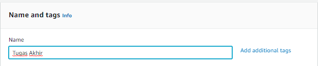
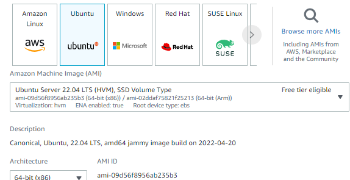
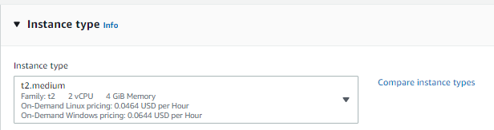
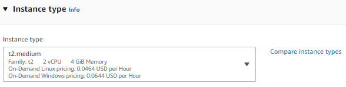
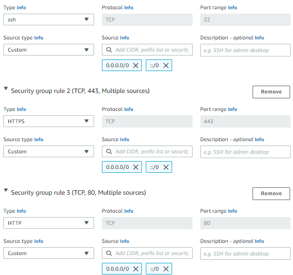
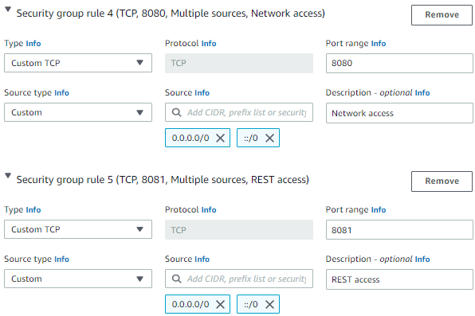
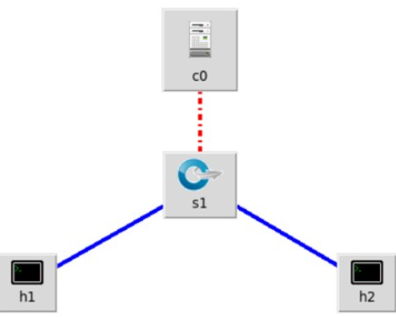
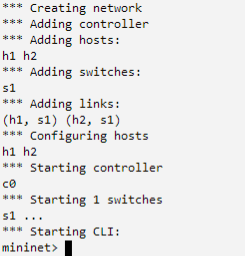
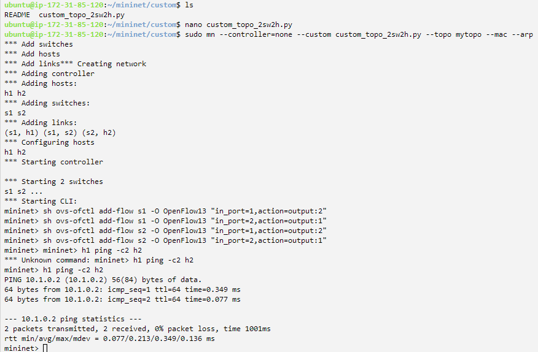
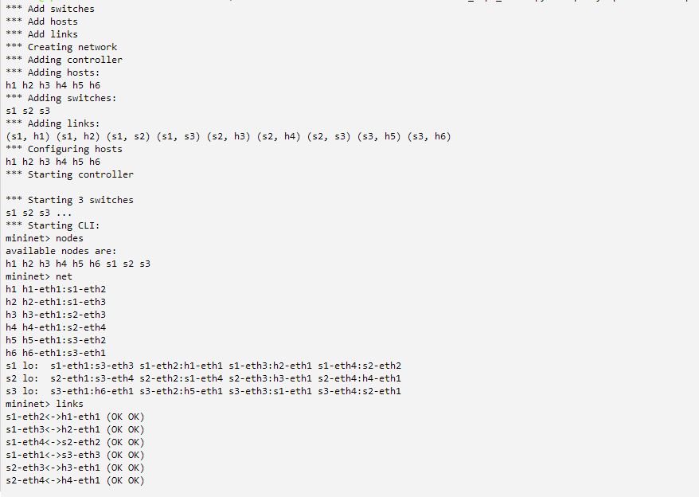

# Tugas-Akhir Arsitektur Jaringan Terkini

## A. Membuat EC2 Instance di AWS Academy

- Ketentuan :
  - Name and tags : Tugas Akhir
    - 
  - OS Images : Ubuntu Server 22.04 LTS 64 bit
    - 
  - Instance type : t2.medium
    - 
  - Key pair : vockey
    - 
  - Edit Network settings : allow SSH, allow HTTP, allow HTTPS, allow TCP port 8080, allow TCP port 8081
    - 
    - 
  - Configure storage : 30 GiB, gp3
    - 

### 1. Langkah Pertama Lakukan Update

- Lakukan update dan upgrade dengan perintah :

```
sudo apt -yy update && sudo apt -yy upgrade
```

### 2. Instalasi Mininet + OpenFlow

Mininet adalah sebuah emulator jaringan yang dapat digunakan untuk membuat sebuah jaringan virtual (dapat terdiri atas host, switch, router, controller, dan link). host pada mininet menjalankan software Linux standar dan switch pada mininet mendukung protokol OpenFlow yang sangat fleksibel untuk dimodifikasi dan mendukung Software-Defined Networking (SDN).

- Unduh repositori Mininet

```
git clone https://github.com/mininet/mininet
```

- Instal mininet

```
mininet/util/install.sh -nfv
```

### 3. Instalasi RYU

Ryu adalah sebuah framework software untuk SDN Controller dan pengembangan aplikasi SDN dan menyediakan beragam komponen software lengkap dengan API yang memudahkan pengembang melakukan pembuatan aplikasi berbasis controller SDN.

- Download repository Ryu dan lakukan instalasi

```
git clone https://github.com/osrg/ryu.git
cd ryu; pip install .
cd
```

Setelah instal Flowmanager, lakukan rebooting Linux untuk membuat lingkungan operasional Python, Mininet, Ryu dan OpenFlow dapat berjalan dengan baik.

### 4. Percobaan Sederhana

- Interaksi dengan Host dan Switch
  - 
  - 

```
sudo mn
```

Perintah ini secara default membuat topologi 2 host dengan 1 switch dan 1 OpenFlow reference controller.

- Menampilkan apa saja daftar perintah Mininet CLI :

```
mininet> help
```

- Menampilkan nodes :

```
mininet> nodes
```

- Menampilkan links :

```
mininet> net
```

- Menampilakan informasi semua nodes :

```
mininet> dump
```

- Tes koneksi antar Host

```
ubuntu@ip-172-31-85-120:~$ sudo mn
*** Creating network
*** Adding controller
*** Adding hosts:
h1 h2
*** Adding switches:
s1
*** Adding links:
(h1, s1) (h2, s1)
*** Configuring hosts
h1 h2
*** Starting controller
c0
*** Starting 1 switches
s1 ...
*** Starting CLI:
mininet> pingall
*** Ping: testing ping reachability
h1 -> h2
h2 -> h1
*** Results: 0% dropped (2/2 received)
mininet> h1 ping -c 2 h2
PING 10.0.0.2 (10.0.0.2) 56(84) bytes of data.
64 bytes from 10.0.0.2: icmp_seq=1 ttl=64 time=0.267 ms
64 bytes from 10.0.0.2: icmp_seq=2 ttl=64 time=0.065 ms

--- 10.0.0.2 ping statistics ---
2 packets transmitted, 2 received, 0% packet loss, time 1032ms
rtt min/avg/max/mdev = 0.065/0.166/0.267/0.101 ms
mininet>
```

## B. Membuat Custom Topology Mininet

Pada bagian ini kita akan membuat custom topologi dengan menggunakan mininet

### 1. Masuk pada direktori Mininet dan Custom

- Gunakan perintah dibawah untuk masuk ke direktori mininet

```
cd mininet/custom
```

### 2. Masuk dan edit file custom_topo_2sw2h.py

- Edit file dan masukan kode program

```
nano custom_topo_2sw2h.py
```

- Kode program (Perhatikan penggunaan spasi dan tab karena berpengaruh)

```
#!/usr/bin/env python
" Custom Topology "

from mininet.topo import Topo
from mininet.log import setLogLevel, info

class MyTopo( Topo ):
    def addSwitch(self, name, **opts ):
      kwargs = { 'protocols' : 'OpenFlow13'}
      kwargs.update( opts )
      return super(MyTopo, self).addSwitch( name, **kwargs )

    def __init__( self ):
    # Inisialisasi Topology
      Topo.__init__( self )

      # Tambahkan node, switch, dan host
      info( '*** Add switches\n')
      s1 = self.addSwitch('s1')
      s2 = self.addSwitch('s2')
      # ....
      info( '*** Add hosts\n')
      h1 = self.addHost('h1', ip='10.1.0.1/24')
      h2 = self.addHost('h2', ip='10.1.0.2/24')
      # ...
      info( '*** Add links\n’)
      self.addLink(s1, h1, port1=1, port2=1)
      self.addLink(s1, s2, port1=2, port2=1)
      self.addLink(s2, h2, port1=2, port2=1)
      # ....
topos = { 'mytopo': ( lambda: MyTopo() ) }
```

- Jalankan mininet tanpa controller menggunakan custom topo yang anda sudah buat dengan perintah

```
sudo mn --controller=none --custom custom_topo_2sw2h.py --topo mytopo --mac --arp
```

- Setelah masuk ke Mininet Buat flow agar h1 dapat terhubung dengan h2

```
mininet> sh ovs-ofctl add-flow s1 -O OpenFlow13 "in_port=1,action=output:2"
mininet> sh ovs-ofctl add-flow s1 -O OpenFlow13 "in_port=2,action=output:1"
mininet> sh ovs-ofctl add-flow s2 -O OpenFlow13 "in_port=1,action=output:2"
mininet> sh ovs-ofctl add-flow s2 -O OpenFlow13 "in_port=2,action=output:1"
```

- Uji koneksi agar h1 dengan h2

```
mininet> h1 ping -c2 h2
```

- 

### 3. Membuat Custom Topologi 3 switch dan 6 host

- Gunakan perintah dibawah untuk masuk ke direktori mininet

```
cd mininet/custom
```

### 4. Masuk dan edit file custom_topo_3sw6h.py

- Edit file dan masukan kode program

```
nano custom_topo_3sw6h.py
```

- Kode program (Perhatikan penggunaan spasi dan tab karena berpengaruh), lalu secara manual menulis flow pada masing-masing switch seperti kode program dibawah

```
#!/usr/bin/env python
from mininet.topo import Topo
from mininet.log import setLogLevel, info
class MyTopo( Topo ):
   def addSwitch(self, name, **opts ):
     kwargs = { 'protocols' : 'OpenFlow13'}
     kwargs.update( opts )
     return super(MyTopo, self).addSwitch( name, **kwargs )
   def __init__( self ):
    "Create MyTopo topology..."

     # Inisialisasi Topology
     Topo.__init__( self )
     # Tambahkan node, switch, dan host
     info( '*** Add switches\n')
     s1 = self.addSwitch('s1')
     s2 = self.addSwitch('s2')
     s3 = self.addSwitch('s3')
     info( '*** Add hosts\n')
     h1 = self.addHost('h1', ip='10.1.0.1/24')
     h2 = self.addHost('h2', ip='10.1.0.2/24')
     h3 = self.addHost('h3', ip='10.1.0.3/24')
     h4 = self.addHost('h4', ip='10.1.0.4/24')
     h5 = self.addHost('h5', ip='10.1.0.5/24')
     h6 = self.addHost('h6', ip='10.1.0.6/24')


     info( '*** Add links\n')
     self.addLink(s1, s2)
     self.addLink(s1, s3)
     self.addLink(s2, s3)
     self.addLink(s1, h1)
     self.addLink(s1, h2)
     self.addLink(s2, h3)
     self.addLink(s2, h4)
     self.addLink(s3, h5)
     self.addLink(s3, h6)
topos = { 'mytopo': ( lambda: MyTopo() ) }
```

- Jalankan mininet tanpa controller menggunakan custom topo yang anda sudah buat dengan perintah

```
sudo mn --controller=none --custom custom_topo_3sw6h.py --topo mytopo --mac --arp
```

- 
