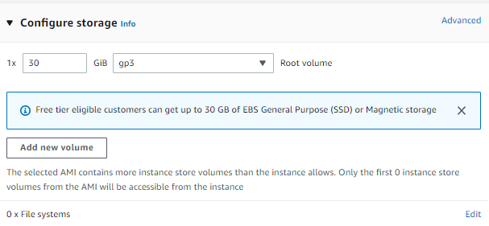

# Tugas-Akhir Arsitektur Jaringan Terkini

## Membuat EC2 Instance di AWS Academy

- Ketentuan :
  - Name and tags : Tugas Akhir
    
  - OS Images : Ubuntu Server 22.04 LTS 64 bit
    
  - Instance type : t2.medium
    
  - Key pair : vockey
    
  - Edit Network settings : allow SSH, allow HTTP, allow HTTPS, allow TCP port 8080, allow TCP port 8081
    
    
  - Configure storage : 30 GiB, gp3
    

## 1. Langkah Pertama Lakukan Update

- Lakukan update dan upgrade dengan perintah :

```
sudo apt -yy update && sudo apt -yy upgrade
```

## 2. Instalasi Mininet + OpenFlow

Mininet adalah sebuah emulator jaringan yang dapat digunakan untuk membuat sebuah jaringan virtual (dapat terdiri atas host, switch, router, controller, dan link). host pada mininet menjalankan software Linux standar dan switch pada mininet mendukung protokol OpenFlow yang sangat fleksibel untuk dimodifikasi dan mendukung Software-Defined Networking (SDN).

- Unduh repositori Mininet

```
git clone https://github.com/mininet/mininet
```

- Instal mininet

```
mininet/util/install.sh -nfv
```

## 3. Instalasi RYU

Ryu adalah sebuah framework software untuk SDN Controller dan pengembangan aplikasi SDN dan menyediakan beragam komponen software lengkap dengan API yang memudahkan pengembang melakukan pembuatan aplikasi berbasis controller SDN.

- Download repository Ryu dan lakukan instalasi

```
git clone https://github.com/osrg/ryu.git
cd ryu; pip install .
cd
```

Setelah instal Flowmanager, lakukan rebooting Linux untuk membuat lingkungan operasional Python, Mininet, Ryu dan OpenFlow dapat berjalan dengan baik.
