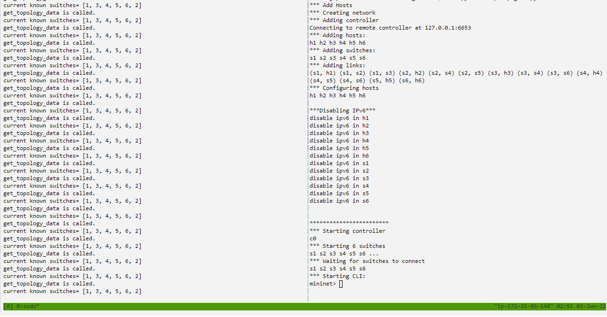

# Tugas-Akhir Arsitektur Jaringan Terkini

## A. Membuat EC2 Instance di AWS Academy

- Ketentuan :
  - Name and tags : Tugas Akhir
    - 
  - OS Images : Ubuntu Server 22.04 LTS 64 bit
    - 
  - Instance type : t2.medium
    - 
  - Key pair : vockey
    - 
  - Edit Network settings : allow SSH, allow HTTP, allow HTTPS, allow TCP port 8080, allow TCP port 8081
    - 
    - 
  - Configure storage : 30 GiB, gp3
    - 

### 1. Langkah Pertama Lakukan Update

- Lakukan update dan upgrade dengan perintah :

```
sudo apt -yy update && sudo apt -yy upgrade
```

### 2. Instalasi Mininet + OpenFlow

Mininet adalah sebuah emulator jaringan yang dapat digunakan untuk membuat sebuah jaringan virtual (dapat terdiri atas host, switch, router, controller, dan link). host pada mininet menjalankan software Linux standar dan switch pada mininet mendukung protokol OpenFlow yang sangat fleksibel untuk dimodifikasi dan mendukung Software-Defined Networking (SDN).

- Unduh repositori Mininet

```
git clone https://github.com/mininet/mininet
```

- Instal mininet

```
mininet/util/install.sh -nfv
```

### 3. Instalasi RYU

Ryu adalah sebuah framework software untuk SDN Controller dan pengembangan aplikasi SDN dan menyediakan beragam komponen software lengkap dengan API yang memudahkan pengembang melakukan pembuatan aplikasi berbasis controller SDN.

- Download repository Ryu dan lakukan instalasi

```
git clone https://github.com/osrg/ryu.git
cd ryu; pip install .
cd
```

Setelah instal Flowmanager, lakukan rebooting Linux untuk membuat lingkungan operasional Python, Mininet, Ryu dan OpenFlow dapat berjalan dengan baik.

### 4. Percobaan Sederhana

- Interaksi dengan Host dan Switch
  - 
  - 

```
sudo mn
```

Perintah ini secara default membuat topologi 2 host dengan 1 switch dan 1 OpenFlow reference controller.

- Menampilkan apa saja daftar perintah Mininet CLI :

```
mininet> help
```

- Menampilkan nodes :

```
mininet> nodes
```

- Menampilkan links :

```
mininet> net
```

- Menampilakan informasi semua nodes :

```
mininet> dump
```

- Tes koneksi antar Host

```
ubuntu@ip-172-31-85-120:~$ sudo mn
*** Creating network
*** Adding controller
*** Adding hosts:
h1 h2
*** Adding switches:
s1
*** Adding links:
(h1, s1) (h2, s1)
*** Configuring hosts
h1 h2
*** Starting controller
c0
*** Starting 1 switches
s1 ...
*** Starting CLI:
mininet> pingall
*** Ping: testing ping reachability
h1 -> h2
h2 -> h1
*** Results: 0% dropped (2/2 received)
mininet> h1 ping -c 2 h2
PING 10.0.0.2 (10.0.0.2) 56(84) bytes of data.
64 bytes from 10.0.0.2: icmp_seq=1 ttl=64 time=0.267 ms
64 bytes from 10.0.0.2: icmp_seq=2 ttl=64 time=0.065 ms

--- 10.0.0.2 ping statistics ---
2 packets transmitted, 2 received, 0% packet loss, time 1032ms
rtt min/avg/max/mdev = 0.065/0.166/0.267/0.101 ms
mininet>
```

## B. Membuat Custom Topology Mininet

Pada bagian ini kita akan membuat custom topologi dengan menggunakan mininet

### 1. Masuk pada direktori Mininet dan Custom

- Gunakan perintah dibawah untuk masuk ke direktori mininet

```
cd mininet/custom
```

### 2. Masuk dan edit file custom_topo_2sw2h.py

- Edit file dan masukan kode program

```
nano custom_topo_2sw2h.py
```

- Kode program (Perhatikan penggunaan spasi dan tab karena berpengaruh)

```
#!/usr/bin/env python
" Custom Topology "

from mininet.topo import Topo
from mininet.log import setLogLevel, info

class MyTopo( Topo ):
    def addSwitch(self, name, **opts ):
      kwargs = { 'protocols' : 'OpenFlow13'}
      kwargs.update( opts )
      return super(MyTopo, self).addSwitch( name, **kwargs )

    def __init__( self ):
    # Inisialisasi Topology
      Topo.__init__( self )

      # Tambahkan node, switch, dan host
      info( '*** Add switches\n')
      s1 = self.addSwitch('s1')
      s2 = self.addSwitch('s2')
      # ....
      info( '*** Add hosts\n')
      h1 = self.addHost('h1', ip='10.1.0.1/24')
      h2 = self.addHost('h2', ip='10.1.0.2/24')
      # ...
      info( '*** Add links\n’)
      self.addLink(s1, h1, port1=1, port2=1)
      self.addLink(s1, s2, port1=2, port2=1)
      self.addLink(s2, h2, port1=2, port2=1)
      # ....
topos = { 'mytopo': ( lambda: MyTopo() ) }
```

- Jalankan mininet tanpa controller menggunakan custom topo yang anda sudah buat dengan perintah

```
sudo mn --controller=none --custom custom_topo_2sw2h.py --topo mytopo --mac --arp
```

- Setelah masuk ke Mininet Buat flow agar h1 dapat terhubung dengan h2

```
mininet> sh ovs-ofctl add-flow s1 -O OpenFlow13 "in_port=1,action=output:2"
mininet> sh ovs-ofctl add-flow s1 -O OpenFlow13 "in_port=2,action=output:1"
mininet> sh ovs-ofctl add-flow s2 -O OpenFlow13 "in_port=1,action=output:2"
mininet> sh ovs-ofctl add-flow s2 -O OpenFlow13 "in_port=2,action=output:1"
```

- Uji koneksi agar h1 dengan h2

```
mininet> h1 ping -c2 h2
```

- 

### 3. Membuat Custom Topologi 3 switch dan 6 host

- Gunakan perintah dibawah untuk masuk ke direktori mininet

```
cd mininet/custom
```

### 4. Masuk dan edit file custom_topo_3sw6h.py

- Edit file dan masukan kode program

```
nano custom_topo_3sw6h.py
```

- Kode program (Perhatikan penggunaan spasi dan tab karena berpengaruh), lalu secara manual menulis flow pada masing-masing switch seperti kode program dibawah

```
#!/usr/bin/env python
from mininet.topo import Topo
from mininet.log import setLogLevel, info
class MyTopo( Topo ):
   def addSwitch(self, name, **opts ):
     kwargs = { 'protocols' : 'OpenFlow13'}
     kwargs.update( opts )
     return super(MyTopo, self).addSwitch( name, **kwargs )
   def __init__( self ):
    "Create MyTopo topology..."

     # Inisialisasi Topology
     Topo.__init__( self )
     # Tambahkan node, switch, dan host
     info( '*** Add switches\n')
     s1 = self.addSwitch('s1')
     s2 = self.addSwitch('s2')
     s3 = self.addSwitch('s3')
     info( '*** Add hosts\n')
     h1 = self.addHost('h1', ip='10.1.0.1/24')
     h2 = self.addHost('h2', ip='10.1.0.2/24')
     h3 = self.addHost('h3', ip='10.1.0.3/24')
     h4 = self.addHost('h4', ip='10.1.0.4/24')
     h5 = self.addHost('h5', ip='10.1.0.5/24')
     h6 = self.addHost('h6', ip='10.1.0.6/24')


     info( '*** Add links\n')
     self.addLink(s1, s2)
     self.addLink(s1, s3)
     self.addLink(s2, s3)
     self.addLink(s1, h1)
     self.addLink(s1, h2)
     self.addLink(s2, h3)
     self.addLink(s2, h4)
     self.addLink(s3, h5)
     self.addLink(s3, h6)
topos = { 'mytopo': ( lambda: MyTopo() ) }
```

- Jalankan mininet tanpa controller menggunakan custom topo yang anda sudah buat dengan perintah

```
sudo mn --controller=none --custom custom_topo_3sw6h.py --topo mytopo --mac --arp
```

- 

## C. Membuat Server Load Balanceing

Load Balancing adalah suatu jaringan komputer yang menggunakan metode untuk mendistribusikan beban kerjaan pada dua atau bahkan lebih suatu koneksi jaringan secara seimbang agar pekerjaan dapat berjalan optimal dan tidak overload (kelebihan) beban pada salah satu jalur koneksi.

- lakukan cloneing dengan perintah dibawah, setelah berhasil cloneing anda akan mendapat 2 buah direktori yang pertama direktori LoadBalancing dan yang kedua adalah SPF dimana kita saat ini akan menggunakan direktori LB (LoadBalancer)

```
git clone https://github.com/abazh/learn_sdn
```

- Masuk ke akun AWS dan masuk ke terminal, kemudian masuk ke direktori LB dengan perintah

```
cd learn_sdn/LB
```

- Kemdian tulis perintah dibawah agar dapat membagi terminal menjadi 2 bagian, untuk membuka terminal baru disebelah tekan (ctrl+b %), untuk berpindah terminal tekan (ctrl+b ;)

```
tmux
```

- Pada terminal 1 tulis perintah

```
sudo python3 topo_lb.py
```

- Pada terminal 2 tulis perintah

```
ryu-manager rr_lb.py
```

- Jika sudah berjalan tampilannya akan menjadi seperti berikut
- 
- Pada terminal 1, h1 menjadi web client, sedangkan h2, h3, h4 harus menjalankan server dengan perintah

```
mininet> h2 python3 -m http.server 80 &
mininet> h3 python3 -m http.server 80 &
mininet> h4 python3 -m http.server 80 &
```

- 
- Lalu tulis perintah dibawah untuk menunjukkan flow
  dengan isi yang diteruskan ke controller

```
dpctl dump-flows -O OpenFlow13
```

- Lalu gunakan h1 sebagai client server dengan perintah

```
h1 curl 10.0.0.100
```

- Pada terminal 1 dilakukan percobaan dengan perintah "h1 curl 10.0.0.100" seperti di atas, dengan hasil pada terminal 2 menunjukan bahwa perintah pertama server yang dipilih adalah server 10.0.0.2, lalu pada perintah yang kedua yang terpilih server 10.0.0.3, kemudian pada perintah ketiga server 10.0.0.4 yang terpilih
- 
- Kemudian ketik perintah di bawah pada terminal 1 untuk melihat flows, setelah muncul dapat dilihat ada beberapa flows yang berjalan mengirimkan paket dengan output pada eth1, eth2, eth3, eth 4.

```
dpctl dump-flows –o openflow13
```

- Sederhananya h1 seperti selalu terhubung dengan 10.0.0.100, karena setiap paket yang
  dikirim dilakukan translasi
- 

## D. Membuat Aplikasi Ryu Shortest Path Routing

- Dalam perutean jalur terpendek, jaringan komunikasi topologi didefinisikan menggunakan grafik berbobot berarah. Node dalam grafik mendefinisikan komponen switching dan busur berarah dalam grafik mendefinisikan koneksi komunikasi antara komponen switching. Setiap busur memiliki bobot yang menentukan biaya berbagi paket antara dua node dalam arah tertentu.
- Pertama jika anda sudah mengikuti percobaan-percobaan diatas anda kemungkinan sudah memiliki direktori "learn_sdn/SPF", jika belum lakukan cloneing

```
git clone https://github.com/abazh/learn_sdn
```

- Masuk ke direktori SPF

```
cd learn_sdn/SPF
```

- Kemudian jalankan "tmux" agar dapat membuat 2 terminal console, untuk membuka terminal baru disebelah tekan (ctrl+b %), untuk berpindah terminal tekan (ctrl+b ;)

```
tmux
```

- Pada Terminal Console 1 jalankan

```
ryu-manager --observe-links dijkstra_Ryu_controller.py
```

- Pada Terminal Console 2 jalankan “

```
sudo python3 topo-spf_lab.py
```

- Pada terminal 1 memantau semua proses yang berjalan, pada terminal 2, 6 switch yang dibuat telah dideteksi dan di terminal 1 terlihat bahwa switch
  telah terhubung ke controller namun belum ada aktivitas apapun namun switch ini terhubung
  dengan controller
- 
- Lanjutkan dengan cek semua konektivitas dengan perintah

```
h1 ping -c 4 h4
h5 ping -c 4 h6
```

- Pada terminal 2 terlihat PING mendapatkana replay, yang artinya h1 dan h4, h5 dan h6 saling terhubung.
- 
- lakukan "pingall" pada terminal 2

```
pingall
```

- Pada terminal 1 akan terjadi suatu proses yang berjalan, dan pada terminal 2 masing masing host tidak bisa langsung bertemu karena pertama kali masih menjalankan komputasi, maka ulangi perintah "pingall" beberapa kali hingga semua host terhubung, saat sudah terhubung hasilnya seperti dibawah, yang artinya semua flow sudah tertanam pada setiap switch sesuai topologi dan jumlah switch, host.
- 
- 

# Terimakasih telah membaca, mohon maaf apabila ada banyak kekurangan, Semoga Ilmu ini Dapat bermanfaat.
